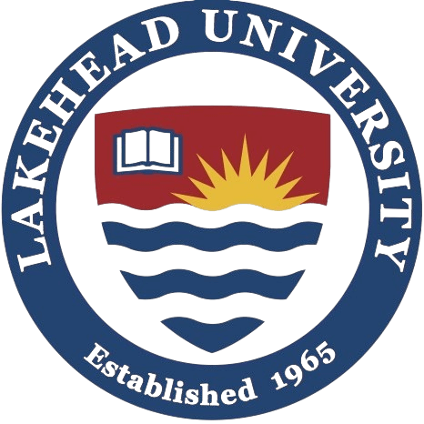
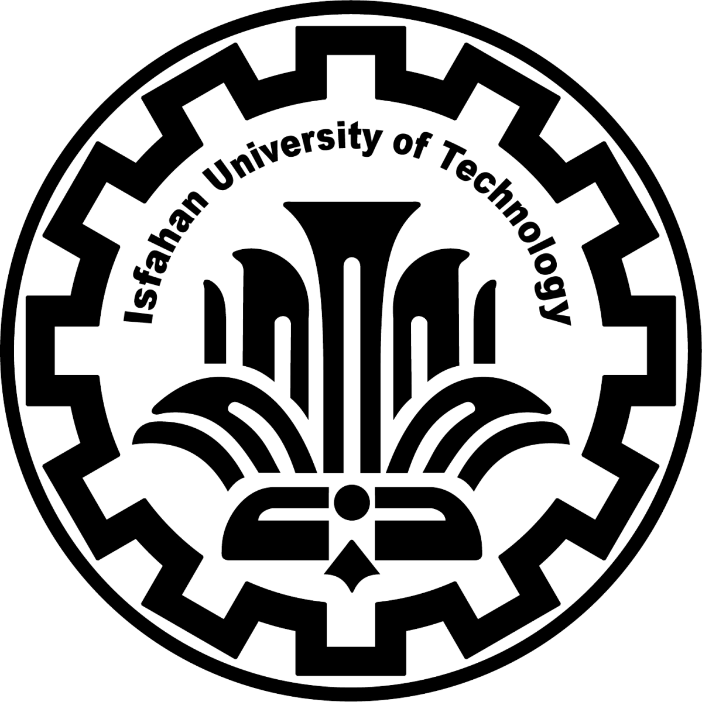
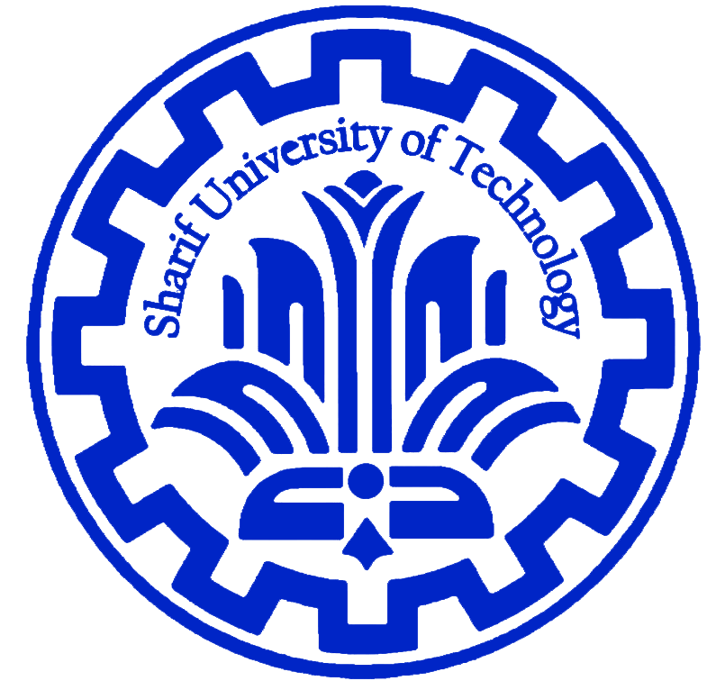
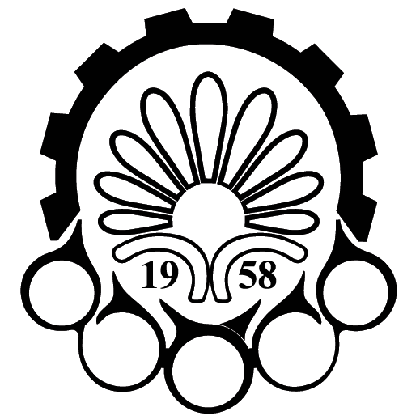

# Amin Shamshiri

**Full-Stack Software Engineer | AI/ML Systems**

Building production web platforms, backend systems, data workflows, and applied AI/ML solutions.

Toronto, Canada

[Portfolio](https://aminshamshiri.com) ·
[LinkedIn](https://www.linkedin.com/in/ma-shamshiri/) ·
[GitHub](https://github.com/ma-shamshiri) ·
[Email](mailto:ma.shamshiri@gmail.com)

---

## About

I am a full-stack software engineer with experience building production SaaS systems, backend services, database-driven applications, and AI-enabled product features.

My work sits at the intersection of **software engineering**, **backend systems**, **data workflows**, and **applied machine learning**. I focus on building reliable, maintainable, and practical systems that solve real business and technical problems.

I hold an M.Sc. in Computer Science from **Concordia University**, where my research focused on applied machine learning and computer vision at **CENPARMI Lab**.

---

## Engineering Focus

| Area | Focus |
|---|---|
| Backend Systems | APIs, services, database design, system reliability, performance |
| Full-Stack Development | Production features, UI workflows, frontend-backend integration |
| AI/ML Systems | ML pipelines, model integration, inference workflows, applied AI features |
| Data Systems | PostgreSQL, SQL workflows, data processing, Kafka-based pipelines |
| DevOps & Delivery | Docker, CI/CD, GitHub Actions, Linux-based deployments |

---

## Technical Stack

**Languages**  
Java, Python, TypeScript, JavaScript, SQL

**Backend & APIs**  
Spring Boot, Node.js, Express, REST APIs, microservices, Kafka

**Frontend**  
React, React Native, Next.js, Tailwind CSS

**Databases & Data**  
PostgreSQL, SQL Server, MySQL, data pipelines, query optimization

**Machine Learning & AI**  
TensorFlow, PyTorch, scikit-learn, NumPy, Pandas, computer vision, time-series analysis, model evaluation

**DevOps & Infrastructure**  
Docker, GitHub Actions, CI/CD pipelines, Linux, Git, production deployments

---

## Selected Work

My pinned repositories highlight work across production software engineering, applied machine learning, and full-stack product development.

Representative areas include:

- **Enterprise software systems:** SaaS features, backend workflows, database-driven applications
- **AI/ML applications:** transfer learning, computer vision, time-series classification, model evaluation
- **Data and automation pipelines:** Kafka-based messaging, PostgreSQL workflows, integration services
- **Full-stack platforms:** interactive UI workflows connected to backend APIs and data services

> See my pinned repositories below for selected projects.

---

## Professional Experience

**Full-Stack Software Engineer, EnerZam**

Building and maintaining production SaaS systems for building operations, asset management, work orders, and enterprise workflows.

Key areas of work include:

- Backend development with Java, Spring, SQL, and production APIs
- Frontend workflows using JavaScript, React, and enterprise UI patterns
- Database-driven features, reporting workflows, and system integrations
- Applied AI/ML and automation features for operational software systems

---

## Research Background

**M.Sc. Computer Science, Concordia University**  
**Graduate Research Assistant, CENPARMI Lab**

Research focus:

- Applied machine learning
- Computer vision
- Transfer learning
- Medical image classification
- Model evaluation with limited annotated data

---

## Community & Volunteer Work

I have contributed as a **Web Developer** to multiple **TEDx events**, building and maintaining event websites used by organizers, speakers, and attendees.

  
  &nbsp;&nbsp;
  
  &nbsp;&nbsp;
  
  &nbsp;&nbsp;
  

  
  &nbsp;&nbsp;
  
  &nbsp;&nbsp;
  

---

## Contact

- Portfolio: [aminshamshiri.com](https://aminshamshiri.com)
- LinkedIn: [linkedin.com/in/ma-shamshiri](https://www.linkedin.com/in/ma-shamshiri/)
- GitHub: [github.com/ma-shamshiri](https://github.com/ma-shamshiri)
- Email: [ma.shamshiri@gmail.com](mailto:ma.shamshiri@gmail.com)
